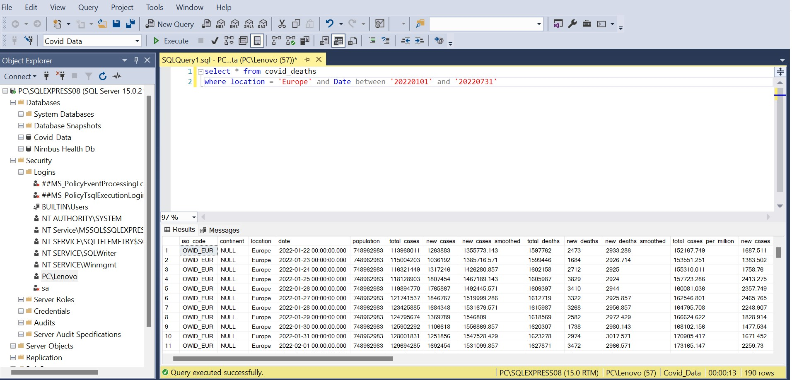

# Data-Migration-from-On-Prem-to-Cloud-Using-Azure-Data-Factory

## Introduction

This project was to migrate data from on Premise to the cloud using Microsoft Azure Data Factory.

Disclaimer!!!! The dataset utilized for this analysis was sourced from Kaggle,  Any findings, conclusions, or insights presented in this analysis are based on the data publicly available on Kaggle. 

## Problem Statement

Company xyz have their data on premises where they maintain and secure all their infrastructure however, In response to the escalating challenges of managing costly on-premises infrastructure, optimizing scalability, and ensuring robust data security, company xyz is ready to migrate to the cloud using Microsoft Azure. This transition will help to unlock cost savings, enhance flexibility, and improve overall business agility while maintaining high standards of data protection and compliance. The final data is to be kept in a container on Microsoft Azure in a Csv format.

## Deliverables

The dataset is about covid 19 deaths across several locations (Europe, Asia etc) from Jan 2019 to July 2022. Company xyz only wants data for Europe migrated to the cloud from Jan 2022 to July 2022.

## Methodology
- Integrated Runtime: Create a self-hosted gateway (integration run time) to connect to the on premise server that hosts the database.
-  Linked Service: Create two linked service in Azure Data Factory by choosing sql server as the link to the on premise data source as the first linked service and the second linked service by choosing Azure Data Lake Storage Gen 2 (Container where the Csv migrated data will be kept).
-  Dataset: Create two new dataset to connect to the linked service created for the sql server as the first dataset and the second dataset to connect the Azure Data Lake Storage Gen 2 linked service which is a csv dataset.
-  Pipeline: Create a pipeline that will connect to the source data set (sql server on prem) and sink the data to the Azure Data Lake Storage Gen 2 storage where the data will be stored.

  

## Exploring the On Premise Data 

As mentioned earlier, only data for Europe is required to be migrated for the period of Jan 2022 to July 2022. Exploring the on premise data shows a total of 190 records is expected to be in the cloud at the end of the project. The image below shows the expected data that is to be migrated to the cloud.

## Connecting to the Company's Microsoft Azure

The azure was set up by creating an azure storage account, azure data factory and an azure resource group as shown below. 

