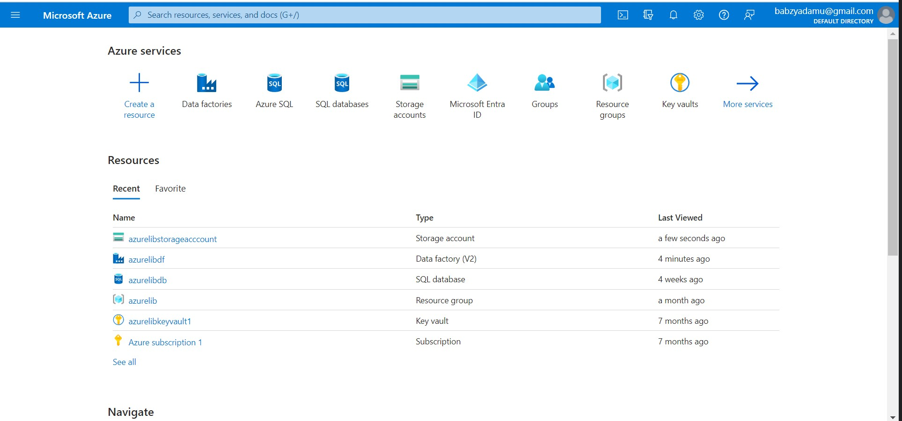
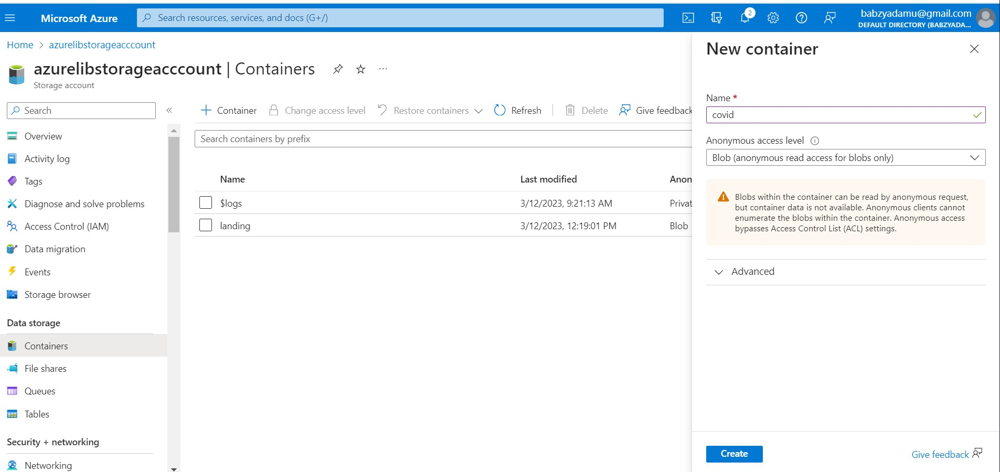
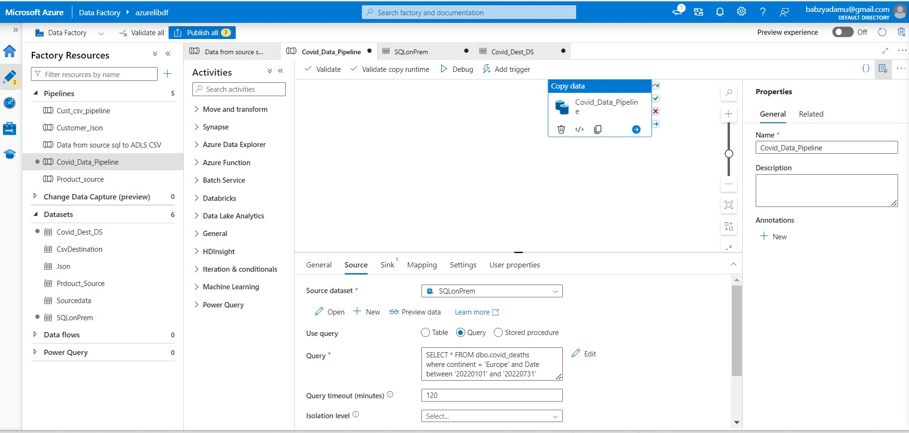
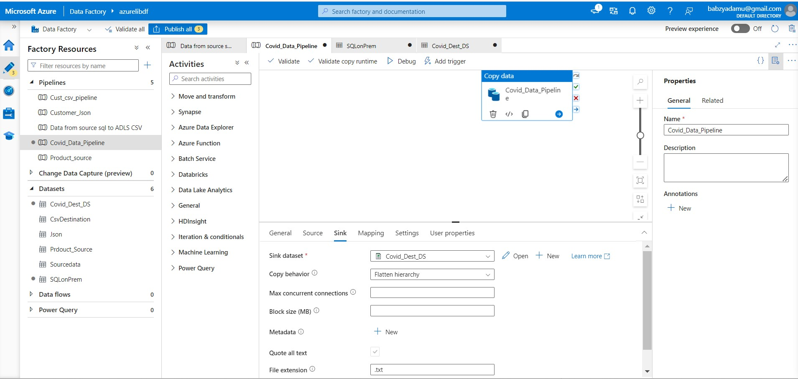

# Data-Migration-from-On-Prem-to-Cloud-Using-Azure-Data-Factory

## Introduction

This project was to migrate data from on Premise to the cloud using Microsoft Azure Data Factory.

Disclaimer!!!! The dataset utilized for this analysis was sourced from Kaggle,  Any findings, conclusions, or insights presented in this analysis are based on the data publicly available on Kaggle. 

## Problem Statement

Company xyz have their data on premises where they maintain and secure all their infrastructure however, In response to the escalating challenges of managing costly on-premises infrastructure, optimizing scalability, and ensuring robust data security, company xyz is ready to migrate to the cloud using Microsoft Azure. This transition will help to unlock cost savings, enhance flexibility, and improve overall business agility while maintaining high standards of data protection and compliance. The final data is to be kept in a container on Microsoft Azure in a Csv format.

## Deliverables

The dataset is about covid 19 deaths across several locations (Europe, Asia etc) from Jan 2019 to July 2022. Company xyz only wants data for Europe migrated to the cloud from Jan 2022 to July 2022.

## Methodology
- Integrated Runtime: Create a self-hosted gateway (integration run time) to connect to the on premise server that hosts the database.
-  Linked Service: Create two linked service in Azure Data Factory by choosing sql server as the link to the on premise data source as the first linked service and the second linked service by choosing Azure Data Lake Storage Gen 2 (Container where the Csv migrated data will be kept).
-  Dataset: Create two new dataset to connect to the linked service created for the sql server as the first dataset and the second dataset to connect the Azure Data Lake Storage Gen 2 linked service which is a csv dataset.
-  Pipeline: Create a pipeline that will connect to the source data set (sql server on prem) and sink the data to the Azure Data Lake Storage Gen 2 storage where the data will be stored.

  

## Exploring the On Premise Data 

As mentioned earlier, only data for Europe is required to be migrated for the period of Jan 2022 to July 2022. Exploring the on premise data shows a total of 9,672 records is expected to be in the cloud at the end of the project. The image below shows the expected data that is to be migrated to the cloud.

## Connecting to the Company's Microsoft Azure

The azure was set up by creating an azure storage account, azure data factory and an azure resource group as shown below. 

The next step was to create a container where the Covid 19 csv dataset will be stored.

A new self integrated run time was created which will create the gateway to connect to the on prem sql database.

After creating the the new integrated run time, the self hosted integration runtime was downloaded and installed as shown below.

## Creating the Linked Service and Datasets (Sql server and ADLS)

The next step was to create the sql server linked service and configure it by linking it to the self hosted integrated runtime that was created earlier.

The sql on prem data set was created and linked to the sql server linked service.

The Azure Data Lake Storage Gen 2 Linked service was also created which will be linked to the csv data set created.

The Azure Data Lake Storage Gen 2 dataset was created in the csv format which was linked to theAzure Data Lake Storage Gen 2 Linked service created earlier.

## Pipeline Creation

A new pipeline was created called Covid_Data_Pipeline. Naming the pipeline is important so that it can be differentiated from other pipelines. Next step was to drag in the copy data function into the pipeline canvas. The copy data function will be used to copy all the data from the on prem to the desired container, It serves as the main engine for copying the data.

The Copy activity was configured using the source and sink. The source is connected to sqlon prem dataset where it copies tge data from and the sink which is the destination is linked to the csv dataset created which is further linked to the ADLS (Azure Data Lake Gen 2 Storage). Recall Company xyz only wants records for Europe between Jan 2022 to July 2022 to be migrated to the cloud, so it was at this point I queried the dataset by choosing query as shown below.

Under mapping the schemas were imported and it is at this point you can edit the column names and change the data types of the data you are migrating from the source data. In this case everything was well transformed so I did not do any transformation.

Next step was to Debug (Execute) the pipeline after configuring all necessary activities which was successful.

Finally I previewed the data in the destination container to ensure 9,672 records are in there as seen in our on premise database and it matched our on premise records.

Having a deeper look at the data in the final destination (Azure Data Lake Gen 2 Storage)

## Conclusion

The duration to migrate all 9,672 records took 19 seconds as seen earlier in our final migration details .

To all my followers, I hope you found this useful. Don't forget to follow me on my [Github](https://github.com/Babzyadamu/) and [Linkedin](https://www.linkedin.com/in/ahmed-adamu-0b63b9a5) as I share more.

